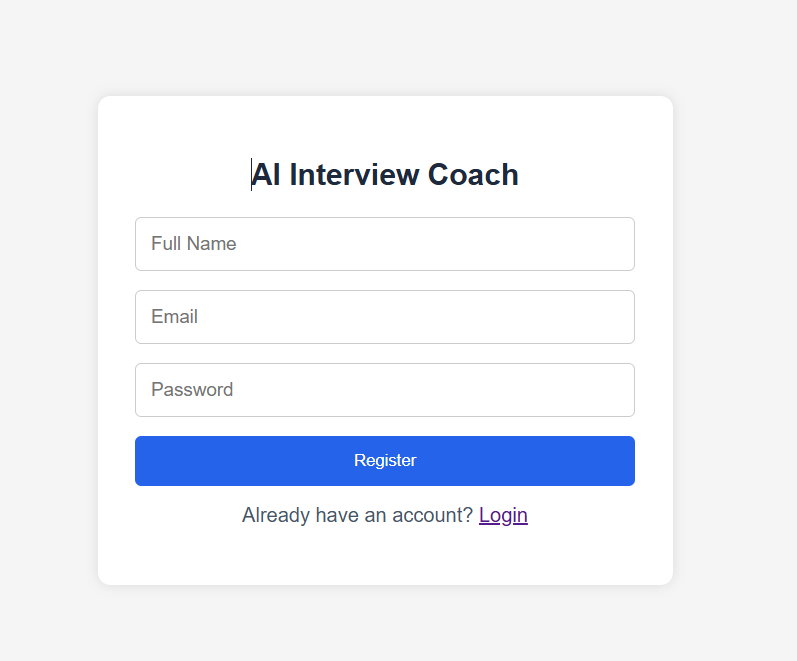
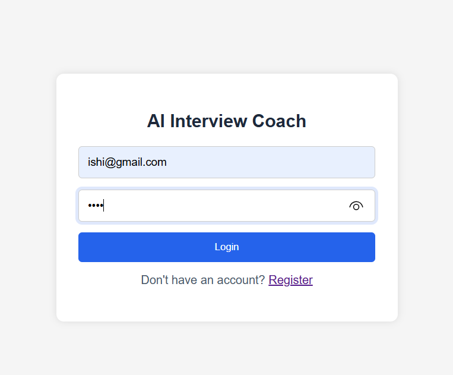
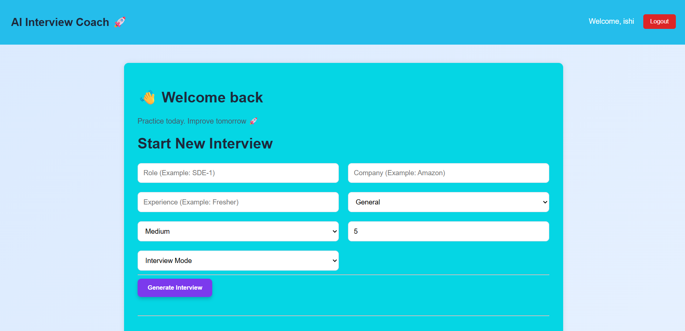
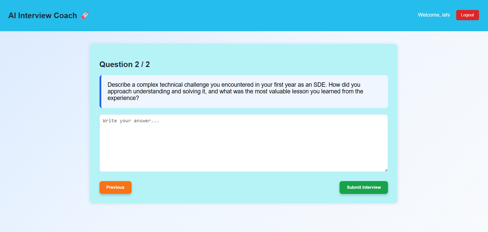
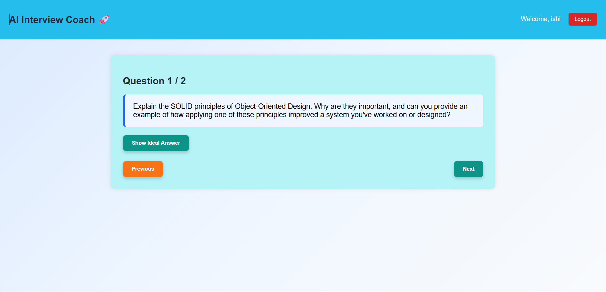
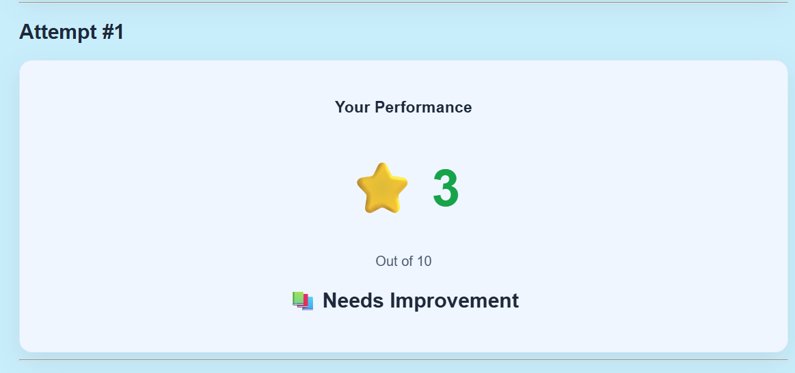
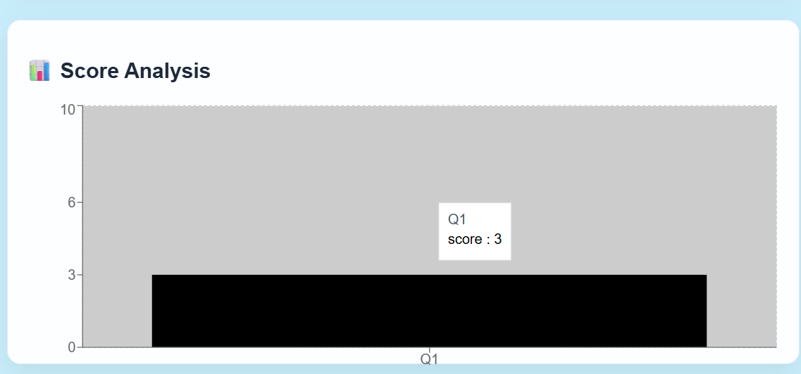
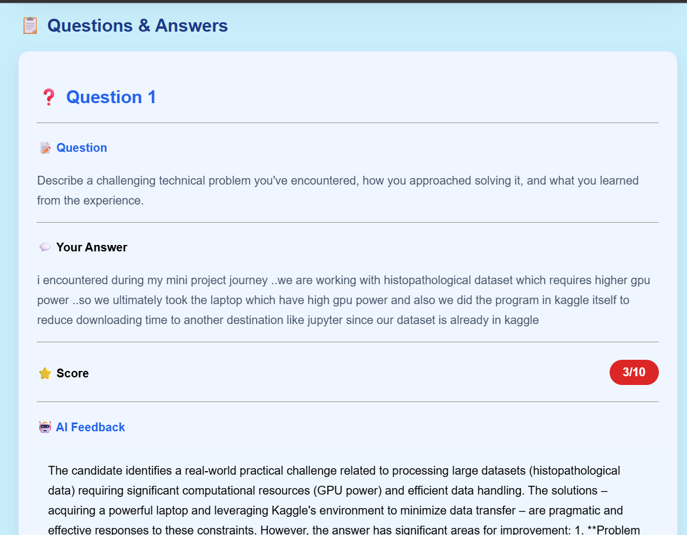
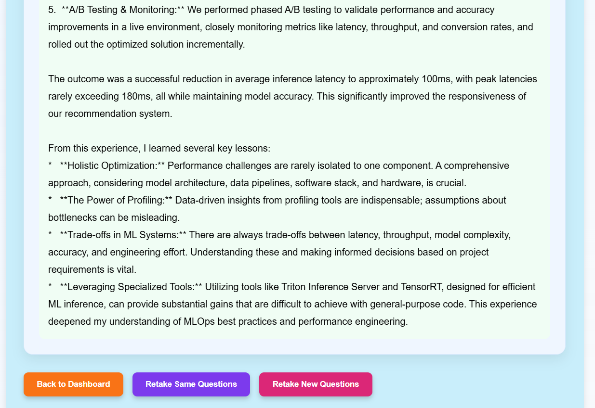
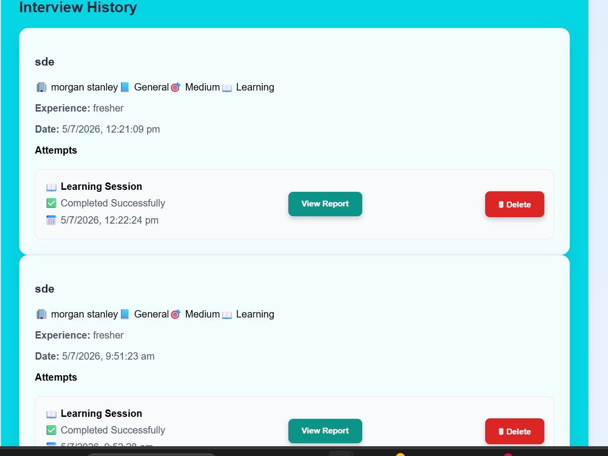

# 🤖 AI Interview Coach

An AI-powered interview preparation platform that helps users practice technical and HR interviews with instant AI feedback, detailed evaluation reports, and a dedicated learning mode.

## 🌐 Live Demo

🔗 https://ai-interview-coach-v2-one.vercel.app

---

## ✨ Features

### 🎤 Interview Mode
- Generate AI interview questions based on:
  - Role
  - Company
  - Experience
  - Topic
  - Difficulty
- Answer questions one by one
- Receive AI-generated evaluation
- Detailed feedback for every answer
- Ideal answers for improvement
- Score analysis with charts
- Interview history with multiple attempts
- Retake same interview
- Generate new interview

### 📖 Learning Mode
- Learn interview questions without evaluation
- View AI-generated ideal answers
- Save learning sessions
- Review previously learned questions

### 📊 Dashboard
- Interview history
- Previous reports
- Multiple attempts
- Average score
- Latest score
- Attempt duration
- Performance chart
- Delete interview history

### 🔐 Authentication
- User Registration
- User Login
- JWT Authentication
- Protected Routes

---

## 🛠 Tech Stack

### Frontend
- React
- React Router
- Axios
- Recharts
- CSS

### Backend
- Node.js
- Express.js

### Database
- MongoDB Atlas
- Mongoose

### AI
- Google Gemini API

### Deployment
- Frontend: Vercel
- Backend: Render

---

## 📂 Project Structure

```
AI-Interview-Coach-V2
│
├── frontend
│   ├── src
│   ├── components
│   ├── pages
│   └── ...
│
├── backend
│   ├── controllers
│   ├── models
│   ├── routes
│   ├── middleware
│   └── ...
│
└── README.md
```

---

## 🚀 Installation

### Clone Repository

```bash
git clone https://github.com/Varshini-ReDDyY/AI-Interview-Coach-V2.git
```

### Frontend

```bash
cd frontend
npm install
npm run dev
```

### Backend

```bash
cd backend
npm install
npm start
```

---


# 📸 Application Screenshots

## 🏠 Login Page



---

## 📝 Register Page



---

## 📊 Dashboard



---

## 🎤 Interview Mode



---

## 📖 Learning Mode



---

## 📄 Interview Report






---

## 📚 Learning Report



## 🔮 Future Enhancements

- Voice-based interviews
- AI speech analysis
- Video interview support
- Resume analysis
- Company-wise interview sets

---

## 👩‍💻 Author

**Varshini Reddy**

GitHub:
https://github.com/Varshini-ReDDyY

LinkedIn:
https://www.linkedin.com/in/varshini-reddy-18a9442a4

---

⭐ If you like this project, consider giving it a star.